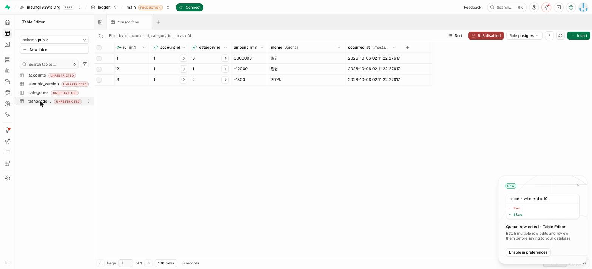
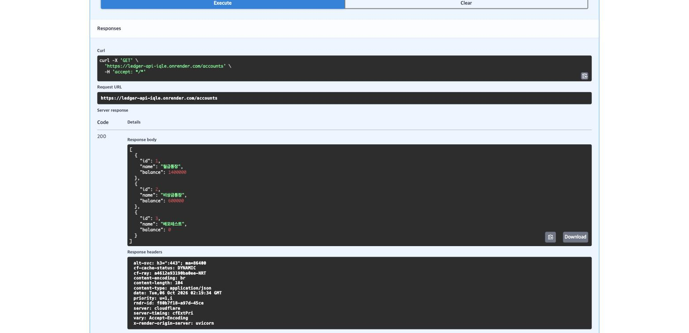

# ledger-api — 가계부 API (FastAPI + SQLAlchemy + Supabase PostgreSQL)

- **GitHub**: https://github.com/insung1939/ledger-api
- **Render**: https://ledger-api-iqle.onrender.com → [/docs](https://ledger-api-iqle.onrender.com/docs)

> 클라우드컴퓨팅실습 W4 과제. 3주차에 메모리에 담던 가계부 데이터를 관계형 DB(Supabase PostgreSQL)에 저장하고,
> FastAPI를 GitHub → Render로 배포해 인터넷 주소의 API가 Supabase를 읽고 쓰는 것을 확인한다.

## 구조

```
요청 → FastAPI(main.py) → SQLAlchemy ORM(models.py) → PostgreSQL(Supabase, Session pooler :5432)
```

| 파일 | 맡는 일 |
|---|---|
| `database.py` | Engine · SessionLocal · Base · `get_db` (DB 연결의 세 부품 + 요청마다 세션 열고 닫기) |
| `models.py` | 테이블 3개 — `accounts` 1:N `transactions` N:1 `categories` |
| `schemas.py` | Pydantic 입출력 형식 (Create / Read / 중첩 `AccountReadWithTx`) |
| `main.py` | 앱 생성 · `create_all` · 엔드포인트 8개 |
| `seed.py` | 샘플 데이터(카테고리·계좌·거래) 투입 — 두 번 실행해도 안전 |
| `render.yaml` | Render Blueprint (Build/Start 명령·환경변수 선언) |
| `.env.example` | 연결 문자열 형식 견본 (`.env`는 Git 제외) |
| `alembic/`, `alembic.ini` | ⑥ 확장 — Alembic 마이그레이션(baseline 1건). `env.py`가 `.env`의 DATABASE_URL과 `Base.metadata`를 읽는다 |

### 데이터베이스 스키마 (models.py)

```
accounts      id PK · name VARCHAR(100) · balance BIGINT
categories    id PK · name VARCHAR(50) UNIQUE · kind VARCHAR(10)
transactions  id PK · account_id FK→accounts.id (NOT NULL) · category_id FK→categories.id (NULL 허용)
              amount BIGINT · memo VARCHAR(200) · occurred_at TIMESTAMP DEFAULT now()
```

### 엔드포인트 (CRUD API 명세)

| 메서드 | 경로 | 하는 일 | 단계 |
|---|---|---|---|
| POST | `/accounts` | 계좌 생성 (201) | ③ |
| GET | `/accounts` | 계좌 목록 | ③ |
| GET | `/accounts/{id}` | 계좌 단건 (없으면 404) | ③ |
| POST | `/transactions` | 거래 생성 — 계좌 없으면 친절한 404 | ④ |
| GET | `/accounts/{id}/detail` | 계좌 + 거래 목록 **중첩 응답** (relationship) | ④ |
| GET | `/stats/by-category` | 카테고리별 지출 합계 (GROUP BY · SUM · COUNT) | ④ |
| POST | `/transfers?from_id&to_id&amount` | 이체 — 출금+입금을 한 commit으로(원자성, `with_for_update`) | ⑦ 확장 |
| GET | `/accounts-with-tx` | 전 계좌 + 거래를 SELECT 2번으로 (`selectinload`, N+1 해결) | ⑦ 확장 |

## 로컬 실행

```bash
python -m venv .venv && source .venv/bin/activate     # Windows: .venv\Scripts\activate
pip install -r requirements.txt
cp .env.example .env    # DATABASE_URL 을 본인 Supabase Session pooler 문자열로 교체
python -c "import database; print(database.engine)"   # Engine(postgresql+psycopg://…) 이면 OK
python seed.py          # 샘플 데이터
uvicorn main:app --reload   # http://127.0.0.1:8000/docs
```

`.env`가 없거나 `DATABASE_URL`을 못 읽으면 `database.py`가 자동으로 로컬 SQLite(`ledger.db`)로 넘어간다(워크북 ③-⑦ 우회).

## 배포 (Render)

| 항목 | 값 |
|---|---|
| Build Command | `pip install -r requirements.txt` |
| Start Command | `uvicorn main:app --host 0.0.0.0 --port $PORT` |
| Environment | `DATABASE_URL` = `.env`의 값 그대로 (Supabase Session pooler, `postgresql+psycopg://…:5432/postgres`) |

코드는 로컬과 한 줄도 다르지 않다. `os.getenv("DATABASE_URL")`이 로컬에서는 `.env`를, Render에서는 Environment Variables를 읽는다.

---

## 실습 기록

### ① 결과 확인

Supabase Table Editor의 `transactions`(로컬 FastAPI → Supabase)와, Render 배포 주소 `/docs`의 `GET /accounts`(인터넷 주소의 API → 같은 Supabase). Render에서 `POST /accounts`로 만든 「배포테스트」 계좌가 Supabase `accounts`에 바로 나타났고, 로컬 서버의 `GET /accounts`에도 보였다 — 앱은 두 곳(내 PC·Render)에 있지만 DB는 Supabase 하나다.




### ② 핵심 개념 되새김

- **계좌·거래를 두 테이블로 나눈 이유(1:N)** — 계좌 하나에 거래가 수십 건씩 쌓이는데, 거래 행마다 계좌 이름을 같이 적어 두면 계좌 이름을 하나 고칠 때 거래를 전부 찾아 고쳐야 한다. 그래서 거래에는 `account_id` 번호만 넣고, 이름이 필요하면 그때 JOIN으로 붙인다. 단계 1에서 `PRAGMA foreign_keys = ON`을 켜야 했던 것도 결국 "없는 계좌를 가리키는 거래"를 DB가 막게 하려는 것이었고, Supabase(PostgreSQL)는 이걸 기본으로 검사한다.
- **SQLAlchemy 모델 클래스와 실제 테이블의 대응** — 단계 1에서 손으로 쓴 `CREATE TABLE accounts (...)`를 단계 3에서는 `class Account(Base)`가 대신한다. 클래스 이름이 아니라 `__tablename__`이 테이블 이름이고, 속성 한 줄이 컬럼 한 개다. `Mapped[str]`은 NOT NULL, `Mapped[str | None]`은 NULL 허용이 되는 걸 보고 "타입 힌트가 곧 제약조건"이라는 게 이해됐다. `create_all()`이 이 클래스를 읽어 Supabase에 테이블을 만들었고, Table Editor에 세 테이블이 그대로 나타났다.
- **접속 문자열을 `.env`로 분리하는 이유** — `DATABASE_URL` 한 줄 안에 DB 비밀번호가 그대로 들어 있다. 이걸 `main.py`에 적었다면 GitHub에 올라가는 순간 공개되고, 지워도 커밋 이력에 남는다. `.env`에 두고 `.gitignore`로 빼면 코드는 공개해도 비밀은 내 PC와 Render 환경변수에만 있다. 실제로 로컬은 `.env`, Render는 Environment Variables에서 같은 이름을 읽기 때문에 배포할 때 코드를 한 줄도 안 바꿨다 — 이게 "환경 분리"의 의미였다.

### ③ 자유 로그

- **단계 1 (SQLite)** — `ledger-sql/`의 네 파일(step1_create · step2_data · step3_join_agg · step4_transfer)을 실행해 CREATE·INSERT·JOIN·GROUP BY·트랜잭션을 확인했다. GROUP BY 결과는 교통 -1,500 / 식비 -12,000 두 줄. `step4`를 여러 번 실행했더니 잔액이 -200,000원까지 내려가 있었다 → 이체 스크립트는 실행할 때마다 10만 원씩 옮기므로 당연한 결과였고, `ledger.db`를 지우고 step1부터 다시 돌려 400,000 / 1,100,000원으로 맞췄다. `raise ValueError("일부러 실패")`를 출금과 입금 사이에 넣으면 출금 UPDATE가 이미 실행됐는데도 `rollback()`이 잔액을 원상복구하는 것을 봤다(원자성).
- **단계 3·4 (FastAPI → DB)** — 처음엔 `.env`를 `sqlite:///./ledger.db`로 두고(③-⑦ 우회) 8개 경로를 모두 호출해 201/404/422/400 응답을 확인한 뒤, Supabase 연결 문자열로 바꿔 같은 코드를 다시 실행했다. 코드는 한 줄도 바꾸지 않았다.
- **단계 6 (확장)** — `alembic init` 후 `env.py`에 `target_metadata = Base.metadata`와 `.env` 주입을 넣고 `revision --autogenerate -m baseline`을 만들었다. `create_all`로 이미 테이블이 있어 생성된 스크립트는 `upgrade()`·`downgrade()`가 `pass`뿐이었고, `op.drop_table`이 없는 것을 확인한 뒤 `upgrade head`로 `alembic_version`에 기준점을 찍었다. `create_all`은 Render 첫 기동 시 안전망으로 남겨 두었다(없는 테이블만 만들므로 Alembic과 충돌하지 않는다).
- **단계 7 (확장)** — `/transfers`에서 commit 직전에 예외를 일부러 일으켜도 `GET /accounts` 잔액이 그대로였다(rollback). `/accounts-with-tx`는 계좌 3개·거래 6건을 불러오는 데 SELECT가 정확히 2번만 나갔다(`selectinload`). 계좌 수만큼 SELECT가 나가는 N+1과 비교해 봤다.
- **AI 활용과 검증** — Claude Code에게 워크북(교재 04)을 그대로 따라 파일을 만들게 하고, 워크북의 각 「확인」 명령(`print(database.engine)`, `Base.metadata.tables`, `model_fields.keys()` 등)과 `curl`·`TestClient` 호출 결과를 워크북에 적힌 기대값과 하나씩 대조해 검증했다. SELECT 횟수는 SQLAlchemy 이벤트 리스너로 세어 확인했다.
- **단계 5 (배포)** — GitHub `insung1939/ledger-api`에 push 후 Render Blueprint(`render.yaml`)로 배포했다. 환경변수 `DATABASE_URL`만 대시보드에서 입력했고 코드는 로컬과 동일하다. 첫 접속은 콜드 스타트로 수십 초 걸렸지만, 3주차와 달리 서비스가 잠들었다 깨어나도 데이터가 남는다 — DB가 앱 밖(Supabase)에 있기 때문이다.
- **막힌 곳과 메모** — gh CLI가 구버전(2.23)이라 `--accept-visibility-change-consequences` 플래그가 없어 `gh repo edit --visibility public`만으로 공개 전환했다. 비밀번호가 대화에 노출된 적이 있어 과제 제출 후 Supabase에서 재설정하고 `.env`·Render 환경변수를 함께 바꿀 예정이다.
